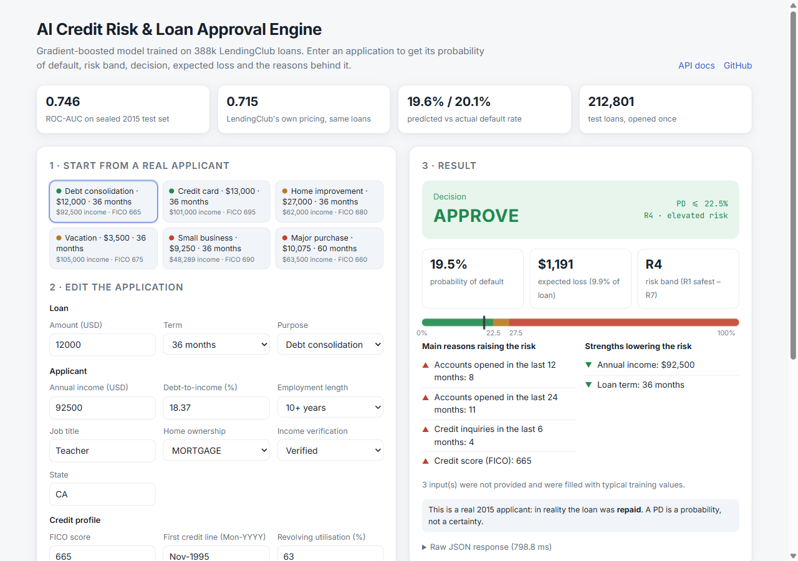
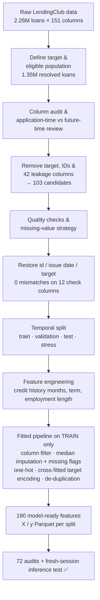

<div align="center">

# 🏦 AI Credit Risk & Loan Approval Engine

**An end-to-end machine-learning engine that estimates the probability that a loan applicant will default,<br/>and turns it into an explainable approve / review / decline decision.**

### 🔴 Live demo: **[credit-risk-engine-dhib.onrender.com](https://credit-risk-engine-dhib.onrender.com)** · [API docs](https://credit-risk-engine-dhib.onrender.com/docs)
<sub>Free hosting: the first visit after 15 idle minutes takes ~50 s to wake up.</sub>


[Pipeline diagram](docs/preprocessing_architecture.svg) ·
[Model strategy (PDF)](docs/model_strategy.pdf) ·
[Preprocessing report](artifacts_v2/preprocessing_v2_report.md) ·
[Final test (PDF)](models/final/05_final_test/F5_final_test.pdf)



</div>

---

## 📌 Overview

Lenders have to decide, at the moment an application arrives, whether a borrower is likely to pay the loan back.
This project builds that decision engine on **2.26 million real LendingClub loans (2007-2018)**:

1. **Credit-risk model**: predicts the **probability of default (PD)** for a new application.
2. **Decision layer**: turns the PD into a risk band, an approve / review / decline decision, an expected loss, and the reasons behind it.
3. **Web deployment** ([live](https://credit-risk-engine-dhib.onrender.com)): a form on a website goes in, and an explainable decision comes out, served by a FastAPI API.

## 🏆 Results (sealed 2015 H2 test set, 212,801 loans, opened once)

| | Our engine (version B) | LendingClub's own interest rate |
|---|---:|---:|
| ROC-AUC | **0.746** | 0.715 |
| KS | 0.360 | – |
| Mean predicted vs actual default rate | 19.6% vs 20.1% | – |

The engine ranks risk better than LendingClub's own pricing **without ever seeing LendingClub's grade or interest rate**.
With the decision policy, it approves **66.8%** of applicants at an **11.6%** default rate (vs 20.1% for all funded loans) and
cuts realised losses per dollar lent from **13.6% to 6.2%**. Criteria were committed before the test set was opened; 7 of 8 were met.
The miss is documented: 60-month loans are under-predicted by about 2.5 points.

The work is done the way a real credit-risk team would do it. Every column is checked for **data leakage**, the model is evaluated on **later loans than it was trained on**, and every preprocessing step is **verified by automated audits**.

## ✨ Highlights

- 🔍 **Leakage-audited features.** All 151 raw columns were classified as *known at application time* vs *only known after the loan starts*. 42 future-information columns (payments, recoveries, settlements, last FICO, ...) were removed.
- 🕰️ **Out-of-time evaluation.** Train on loans issued Aug-2012 to Dec-2014, validate on 2015 H1, test on 2015 H2. Cohorts that were still largely unfinished (2016-2018) are kept apart as a stress test.
- 🧩 **One reusable pipeline.** Feature engineering, imputation, encoding and column selection live in a single fitted scikit-learn `Pipeline` (`preprocessor_v2.joblib`), fitted on training data only.
- 🎯 **Leak-free target encoding.** High-cardinality fields (`zip_code`, `emp_title`, `title`) are target-encoded with 5-fold cross-fitting; unseen categories fall back to the training default rate.
- ✅ **72 automated audits + a fresh-session inference test.** Covers target alignment, temporal ordering, leakage, missing / infinite / non-numeric values, feature alignment and artifact persistence. Raw applications reproduce the exported features exactly.

## 🗺️ Project status

- [x] Data inspection and EDA reports
- [x] Target definition and eligible population
- [x] Column-by-column leakage audit
- [x] Preprocessing V2: temporal split, fitted pipeline, 72/72 audits passing
- [x] Architecture diagram and model strategy document
- [x] Model ladder M0–M4: dummy, Logistic Regression, Random Forest, LightGBM, XGBoost (each with and without LendingClub grade features)
- [x] Final model: monotonic LightGBM, Platt calibration, `zip_code` removed for fair-lending reasons
- [x] SHAP reason codes, geographic fairness checks, decision layer (risk bands, thresholds, expected loss)
- [x] Scoring package with checksummed bundle, final test on the sealed set
- [x] FastAPI service + web page, deployed with Docker
- [ ] Part 2: rejected-applications model

## 📊 Dataset

[LendingClub loan data 2007-2018Q4](https://www.kaggle.com/datasets/wordsforthewise/lending-club) (Kaggle).
The raw files are **not** included in this repository. Put them in `data/`:

```
data/accepted_2007_to_2018Q4.csv   # 2,260,701 loans × 151 columns
data/rejected_2007_to_2018Q4.csv   # rejected applications (Part 2)
```

**Target definition** (only loans with a final outcome are used):

| `target` | Loan status | Loans |
|:---:|---|---:|
| **0** (repaid) | Fully Paid · Does not meet the credit policy: Fully Paid | 1,078,739 |
| **1** (default) | Charged Off · Default · Does not meet the credit policy: Charged Off | 269,360 |
| *excluded* | Current · Late · In Grace Period (no final outcome yet) | 912,602 |

## 🔧 Preprocessing pipeline



👉 **Full step-by-step explanation:** [`docs/preprocessing_architecture.svg`](docs/preprocessing_architecture.svg)

### Temporal split

| Split | Issue months | Loans | Defaults | Default rate |
|---|---|---:|---:|---:|
| Train | 2012-08 → 2014-12 | 388,124 | 66,928 | 17.24% |
| Validation | 2015-01 → 2015-06 | 162,745 | 33,120 | 20.35% |
| Test | 2015-07 → 2015-12 | 212,801 | 42,684 | 20.06% |
| Stress test *(optional)* | 2016-01 → 2018-12 | 518,744 | 116,295 | 22.42% |

> **Why not test on 2016+?** At the 2018Q4 snapshot only 67.5% of 2016 loans had finished, and the finished ones are skewed toward early defaults and early payoffs. **Why start in Aug-2012?** That is when 33 credit-bureau fields begin to be reported.

### The 190 features

| Group | Columns | How they were built |
|---|---:|---|
| Numeric | 62 | Median imputation (train medians), including the engineered `credit_history_months`, `term_months`, `emp_length_years` |
| Missing-value flags | 18 | 0/1 "was missing" indicators (missing often means "never happened") |
| One-hot | 107 | grade, sub_grade, home_ownership, verification_status, purpose, addr_state (rare categories grouped) |
| Target-encoded | 3 | `zip_code`, `emp_title`, `title`: smoothed, out-of-fold default rates |

## 🤖 Model ladder (validation 2015 H1, version B)

Models were added in order of complexity; each had to beat the previous one ([strategy](docs/model_strategy.pdf)).
Every folder in `models/` holds an implementation plan, an executed notebook and a short PDF.

| Step | Model | Validation ROC-AUC | Verdict |
|---|---|---:|---|
| M0 | Dummy baseline | 0.500 | floor |
| M1 | Logistic Regression | 0.725 | strong, explainable baseline |
| M2 | Random Forest | 0.727 | no real gain |
| M3 | **LightGBM** | **0.736** | clear gain → **chosen** |
| M4 | XGBoost | 0.736 | tie: confirms the result; LightGBM is 2.3× faster |

Version **A** uses LendingClub's `grade`, `sub_grade`, `int_rate`, `installment`; version **B** does not.
LendingClub assigns those *after* its own risk decision, so **B is the deployable model**.

**Finalization** (`models/final/`): ① monotonic constraints (higher FICO never raises risk) + Platt calibration ·
② SHAP reason codes and fairness: `zip_code` added only +0.0004 ROC-AUC so it was dropped ·
③ decision layer: approve if PD ≤ 22.5%, decline if PD ≥ 27.5%, expected loss = PD × amount × EAD share × LGD ·
④ one checksummed scoring bundle · ⑤ the sealed test, once · ⑥ the live demo.

## 🌐 What the engine returns

`POST /api/score` with a raw application ([try it](https://credit-risk-engine-dhib.onrender.com/docs)):

```json
{
  "probability_of_default": 0.2879,
  "risk_band": "R5",
  "risk_band_label": "high risk",
  "decision": "DECLINE",
  "decision_rule": "PD >= 27.5%",
  "loan_amount": 10075.0,
  "term_months": 60,
  "expected_loss_usd": 1817.22,
  "reasons": [{"reason": "Loan term: 60 months", "impact": 0.6747}, {"reason": "Credit score (FICO): 660", "impact": 0.2338}, {"reason": "Months since the most recent credit inquiry: 0 months", "impact": 0.1639}, {"reason": "Total bankcard limit: $3,300", "impact": 0.1539}],
  "strengths": [{"reason": "Accounts opened in the last 24 months: 2", "impact": -0.1667}, {"reason": "Job title (historical default rate of similar titles): 14.0%", "impact": -0.1342}],
  "missing_fields": ["mths_since_last_record", "mths_since_recent_bc_dlq", "mths_since_recent_revol_delinq"],
  "model": {"name": "M3-B-mono-nozip", "version": "1.0.0"}
}
```

A real response from the live API (a 2015 applicant from the validation set; this loan was in fact repaid: a PD is a probability, not a verdict). Only `loan_amnt` and `term` are required; any of the 65 input fields can be added, and missing ones are listed back.

## 📁 Repository structure

```
├── run_preprocessing_v2.py        # entry point: runs preprocessing V2 end to end
├── src/preprocessing_v2/          # pipeline code, one module per stage
│   ├── restore.py  split.py  features.py  pipeline.py
│   └── export.py   audits.py  report.py   inference.py  run.py
├── src/modeling/                  # evaluation report card, reason codes, decision layer
├── src/engine/                    # CreditRiskEngine: raw application -> decision JSON
├── models/                        # M0-M4 + final/ stages 1-5 (plan, notebook, PDF, results each)
│   └── final/04_scoring_package/bundle/   # model, preprocessor, calibrator, policy + checksums
├── deploy/                        # FastAPI app, web page, Docker / Space builders
├── Dockerfile  render.yaml        # live deployment (Render)
├── tests/                         # fresh-session tests (preprocessing, engine) + API tests
├── notebooks/                     # data inspection, preprocessing V1 (Steps 1-10), V2 walkthrough
├── reports/                       # EDA reports, V1 audit tables
├── docs/                          # architecture diagram, model strategy PDF (+ generators)
├── artifacts_v2/                  # metadata, audit report, feature lists (fitted .joblib not tracked)
├── data/                          # raw + interim data (not tracked)
└── final_preprocessed_data_v2/    # model-ready Parquet files (not tracked)
```

## 🚀 Getting started

```bash
git clone https://github.com/mitanshkanani/AI-Credit-Risk-Loan-Approval-Engine.git
cd AI-Credit-Risk-Loan-Approval-Engine
pip install -r requirements.txt
```

1. Download the dataset into `data/` (see [Dataset](#-dataset)).
2. Run `notebooks/accepted_preprocessing.ipynb` through **Step 10**. It writes `data/interim/accepted_quality_clean.csv`.
3. Run preprocessing V2:
   ```bash
   python run_preprocessing_v2.py   # ~2 minutes, ~16 GB RAM machine recommended
   ```
   It writes `final_preprocessed_data_v2/` and `artifacts_v2/`, and ends with `PREPROCESSING V2: COMPLETE`.
4. Score a raw application with the saved pipeline:
   ```python
   from src.preprocessing_v2 import inference
   pre = inference.load_preprocessor()
   features = inference.transform_applications([{"issue_d": "Oct-2026", "loan_amnt": 12000, "term": " 36 months"}], pre)
   print(features.shape)   # (1, 190) - missing fields are imputed
   ```

5. Run the engine and the website locally:
   ```bash
   pip install -r deploy/requirements.txt
   python -m uvicorn deploy.app.main:app --port 7860   # open http://localhost:7860
   ```
   ```python
   from src.engine import CreditRiskEngine
   CreditRiskEngine().score({"loan_amnt": 12000, "term": 36, "fico_range_low": 700, "annual_inc": 72000})
   ```

## 🛠️ Tech stack

Python · pandas · NumPy · scikit-learn · LightGBM · XGBoost · SHAP (LightGBM `pred_contrib`) · FastAPI · Docker · Render ·
Kaggle (training runs) · PyArrow / Parquet · joblib · ReportLab · Sweetviz.

## 👤 Author

**Mitansh Kanani** · [GitHub @mitanshkanani](https://github.com/mitanshkanani)

<div align="center"><sub>If you find this project useful, consider giving it a ⭐</sub></div>
